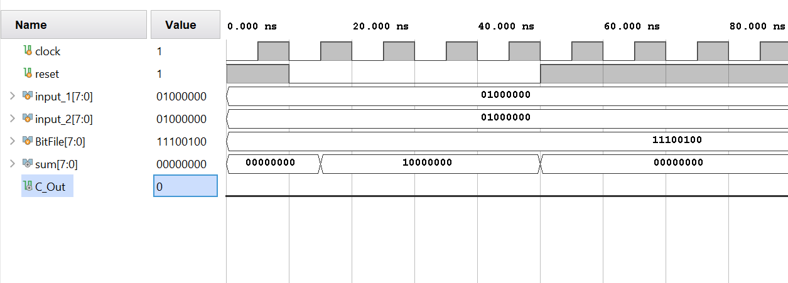
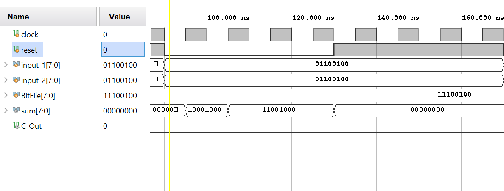
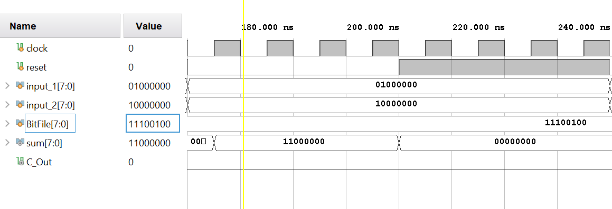
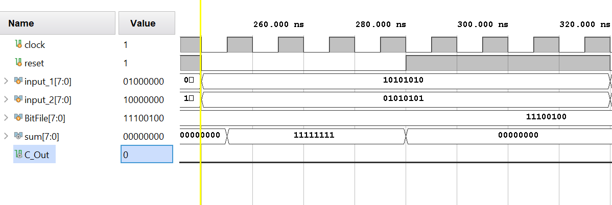
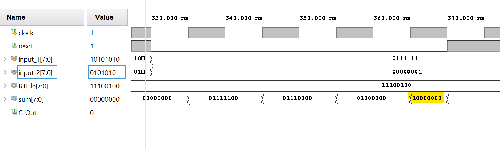
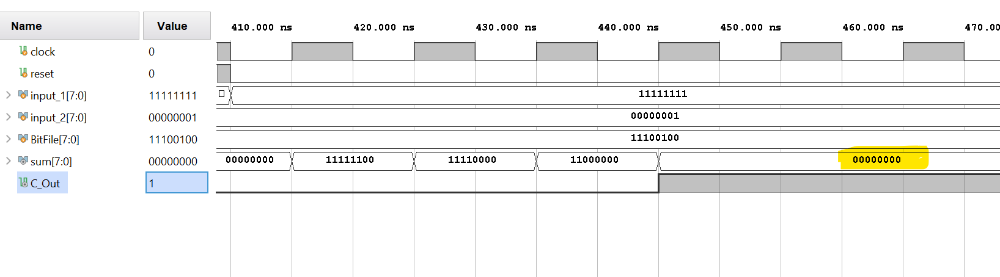

# Field Programmable Gate Array

There are two main components of an FPGA: the CLB (configurable logic block) and the routing channel/interconnect.

The configurable logic block is essentially the combinational block of the FPGA, but instead of having adders and multipliers, we have a Look-Up Table (LUT) or a ROM, where the outputs of a particular combinational operation are pre-computed.

Everything that goes into the CLB, and comes out of it has to do this through the routing channel. In a normal FPGA, actual switches are used, however, in this repository, I have used multiplexers instead. 

To add the two 8-bit numbers, I first give the numbers to the routing channel where they are sliced into 2-bit numbers and sent to the correct CLB. This is done using multiplexers with the control signal coming from a ``bit file``. A CLB then sends its carry-out and the sum of the 2-bit slices to the routing channel, after which the routing channel sends the carry-out of the first CLB as the carry-in to the next CLB. This is also done using the multiplexers whose control signal comes from the bit file. In the end, all the sums are concatenated to get the 8-bit output. This operation can be done within one cycle as well, and at most in 4 clock cycles, depending on the input signals and carry generated, because there is a flip flop at the output of every CLB.

## Configurable Logic Block (CLB)
The CLB takes two 2-bit numbers, along with a carry-in as inputs, and generates the 2-bit sum and a carry-out as outputs through a look-up table. This is done at the positive edge of the clock cycle.

The lookup table is of 5 bits, 1 bit for carry-in, 2 bits for the first number, and 2 bits for the second number, therefore there are 32 possible combinations pre-computed in the LUT. 

## Routing Channel
The routing channel controls all the inputs and outputs using multiplexers. The multiplexers are controlled by a bit file which is an 8-bit binary number. The reason for it being 8-bits is that all the multiplexers are 4:1, therefore a 2-bit control signal is required for each. And since I was making separate multiplexers for each CLB, I needed 4 such control signals, therefore, I chose an 8-bit number where:

- ``Bitfile[1:0]`` controls the CLB A
- ``Bitfile[3:2]`` controls the CLB B
- ``Bitfile[5:4]`` controls the CLB C
- ``Bitfile[7:6]`` controls the CLB D

In the code (``CLB.v``), to make everything configurable, I have created the cases such that even the slices of the input numbers can be sent to any CLB, not just to a predefined CLB. All other signals, except the reset and clock, can also be controlled using the bit file.

## Simulation
Because of the D-Flip Flops placed at the output of the CLB modules, the output comes only at the positive edge of the cycle because of which in some cases, where the output of the higher bits depends on the carry generated by the lower bits, the correct output might not be achieved in the same clock cycle. It can take up to 4 clock cycles as seen in Figures (ADD LAST TWO IMAGES HERE).

1. Addition of 64 + 64 = 128
   

   
  

2. Addition of 100 + 100 = 200
   

    
   

3. Addition of 64 + 128 = 192
   

    
   

4. Addition of 170 + 85 = 255
   

    
   

5. Addition of 127 + 1 = 128. Example of the case where the correct output comes after 4 cycles because of carry (highlighted output is correct).
   

    
   

6. Addition of 255 + 1 = 256. Example of a case where the correct output comes after 4 cycles because of carry, and an example of overflow.
   

    
   

---
**Contributions:** All of the code in this repository is written by [Samiya Ali Zaidi](https://www.linkedin.com/in/samiya-ali-zaidi)
